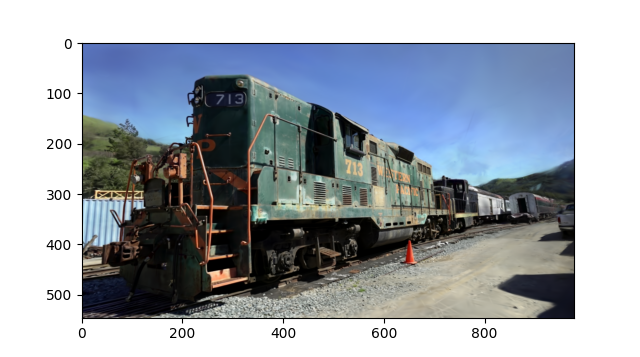
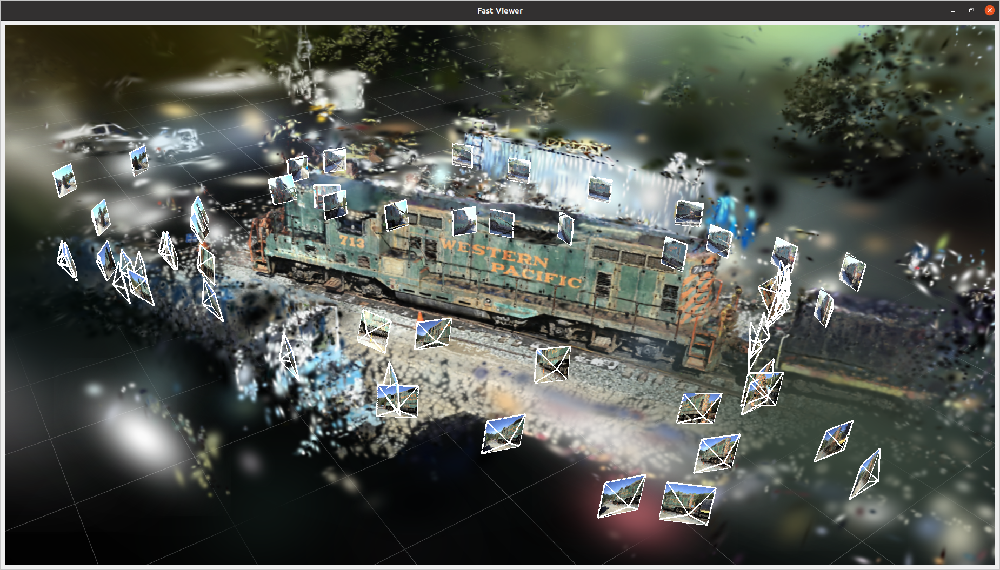

# Easy Gaussian Splatting

## What is this? 

For learning purposes, we offer an unofficial implementation of [3D Gaussian Splatting
for Real-Time Radiance Field Rendering](https://repo-sam.inria.fr/fungraph/3d-gaussian-splatting/). Additionally, we provide a set of tools and documentation to facilitate the study of 3D Gaussian Splatting.


## Why this name?

We want our implementation to be easy to use, the code to be easy to read, and the documentation to be easy to understand. Therefore, we named our project "EasyGaussianSplatting".


## Overview 

* Detailed documentation to demonstrate the mathematical principles of 3D Gaussian Splatting
    - [Documentation for Forward (rendering)](docs/forward.pdf)
    - [Documentation for Backward (training)](docs/backward.pdf)

- Based on our documentation, re-implement 3D Gaussian Splatting.
    - Forward on CPU
    - Forward on GPU
    - Backward on CPU
    - Backward on GPU
    - Full training implemention.

- Provide tools for learning 3D Gaussian Splatting.
    -  A efficient viewer based on pyqtgraph for showing 3D Gaussian data (trained model).
    -  A demo showing how spherical harmonics work.
    -  Verify all computation processes of backward using numerical differentiation.

## Requirements 

```bash
pip3 install -r requirements.txt
pip3 install gsplatcu/.
```

## Rendering

Given camera information, render 3D Gaussian data onto the 2D image.

The `TRAINED_FILE` is the .ply file generated by the official Gaussian Splatting, or the .npy file generated by our train.py.

**CPU version**
```bash
python3 forward_cpu.py --gs='THE_PATH_OF_YOUR_TRAINED_FILE'
```


**GPU version.**
```bash
python3 forward_gpu.py --gs='THE_PATH_OF_YOUR_TRAINED_FILE'
```


## Training

Download the T&T+DB COLMAP datasets.
[T&T+DB COLMAP (650MB)](https://repo-sam.inria.fr/fungraph/3d-gaussian-splatting/datasets/input/tandt_db.zip) 

```bash
python3 train.py --path='THE_PATH_OF_DATASET'
```

## 3D Gaussian Viewer 

A efficient 3D Gaussian splatting viewer for showing 3D Gaussian data. 

Press the keyboard key [M] to open the settings window. You will find more fun functions there.

```bash
python3 gaussian_viewer.py --gs='THE_PATH_OF_YOUR_TRAINED_FILE'
```


Our viewer supports checking your dataset.

```bash
python3 gaussian_viewer.py --path='THE_PATH_OF_DATASET'
```




## Spherical harmonics demo

A demo showing how spherical harmonics work.

```bash
python3 sh_demo.py
```


<sup><sub>"The ground truth Earth image is modified from [URL](https://commons.wikimedia.org/wiki/File:Solarsystemscope_texture_8k_earth_daymap.jpg). By Solar System Scope. Licensed under CC-BY-4.0"</sub></sup>

## Verify the backward process

Verify all computation processes of backward using numerical differentiation.

```bash
python3 backward_cpu.py
python3 backward_gpu.py
```